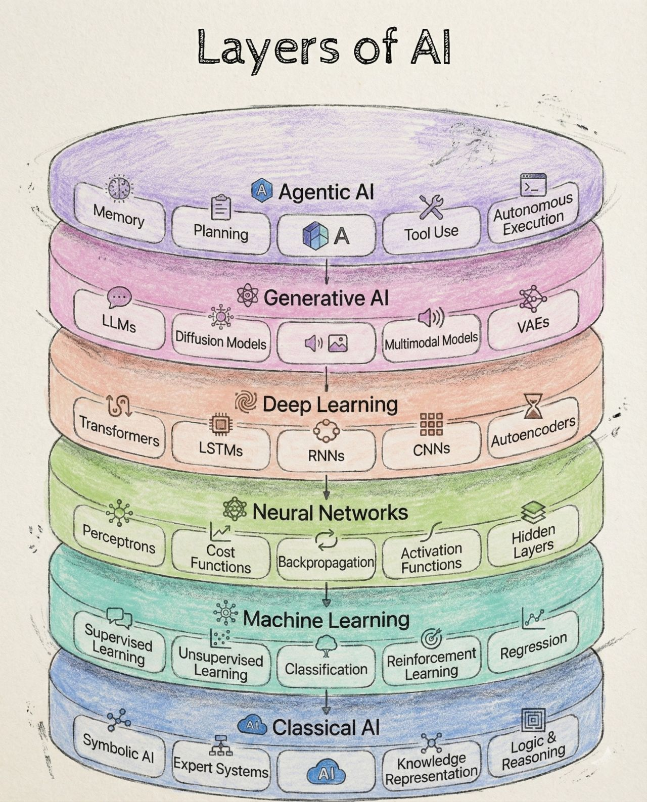

# __ARTIFICIAL INTELLIGENCE__

!!! note "PART A: BASICS"
    This part serves as the foundation.

{width=100%}

## __GET STARTED__

-  :material-book:{ .lg .middle } __Little Book of Deep Learning 🏆__

    ---

    [:octicons-arrow-right-24: <a href="[lbdl.pdf](https://fleuret.org/francois/lbdl.html)" target="_blank"> Portal </a>](#)

-  :material-book:{ .lg .middle } __Deep Learning：Foundations and Concepts 🏆__

    ---

    [:octicons-arrow-right-24: <a href="https://www.bishopbook.com/" target="_blank"> Portal </a>](#)

-   :fontawesome-brands-square-github:{ .lg .middle } __Dive Into Deep Learning 🏆__

    --- 

    [:octicons-arrow-right-24: <a href="https://d2l.ai/" target="_blank"> Portal </a>](#) 

## __HANDS-ON__

-   :simple-nvidia:{ .lg .middle } __NVIDA CUDA🏆__

    --- 

    [:octicons-arrow-right-24: <a href="https://docs.nvidia.com/cuda/cuda-installation-guide-microsoft-windows/" target="_blank"> Portal </a>](#) 

-   :simple-pytorch:{ .lg .middle } __PyTorch🏆__

    --- 

    [:octicons-arrow-right-24: <a href="https://pytorch.org/" target="_blank"> Portal </a>](#)

-   :simple-tensorflow:{ .lg .middle } __TensorFlow🏆__

    --- 

    [:octicons-arrow-right-24: <a href="https://www.tensorflow.org/" target="_blank"> Portal </a>](#)

-   :simple-keras:{ .lg .middle } __KERAS 🏆__

    --- 

    [:octicons-arrow-right-24: <a href="https://keras.io/" target="_blank"> Portal </a>](#) 

-   :hugging:{ .lg .middle } __HUGGING FACE 🏆__

    --- 

    [:octicons-arrow-right-24: <a href="https://huggingface.co/" target="_blank"> Portal </a>](#)

!!! note "PART B: ADVANCED TOPICS"
    This part is the advanced content.

## __ADVANCED TOPICS__

### __REINFORCEMENT LEARNING__

-   :fontawesome-brands-bilibili:{ .lg .middle } __李宏毅-Reinforcement Learning🎯🏆__ 

    ---

    Notes: In Chinese

    Easy for beginners to understand.

    [:octicons-arrow-right-24: <a href="https://www.bilibili.com/video/BV1XP4y1d7Bk/?spm_id_from=333.337.search-card.all.click&vd_source=5a427660f0337fedc22d4803661d493f" target="_blank"> Portal </a>](#)

-   :fontawesome-brands-square-github:{ .lg .middle } __Easy RL🎯✅🏆__ 

    ---

    Notes: In Chinese
    This project should be taken as the notes of 李宏毅-Reinforcement Learning.

    [:octicons-arrow-right-24: <a href="https://datawhalechina.github.io/easy-rl/#/" target="_blank"> Portal </a>](#)

-   :material-web:{ .lg .middle } __Deep Reinforcement Learning: Fundamentals, Research, and Applications🎯🏆__ 

    ---

    [:octicons-arrow-right-24: <a href="https://deepreinforcementlearningbook.org/" target="_blank"> Portal </a>](#)

-   :material-web:{ .lg .middle } __UCL Course on RL🎯🏆__ 

    ---

    [:octicons-arrow-right-24: <a href="https://www.davidsilver.uk/teaching/" target="_blank"> Portal </a>](#)

-   :material-web:{ .lg .middle } __CS285: Deep Reinforcement Learning__ 

    ---

    [:octicons-arrow-right-24: <a href="http://rail.eecs.berkeley.edu/deeprlcourse/" target="_blank"> Portal </a>](#)

    [:octicons-arrow-right-24: <a href="https://www.youtube.com/playlist?list=PL_iWQOsE6TfX7MaC6C3HcdOf1g337dlC9" target="_blank"> Video </a>](#)

-   :material-web:{ .lg .middle } __Reinforcement Learning: An Introduction__ 

    ---

    [:octicons-arrow-right-24: <a href="http://incompleteideas.net/book/RLbook2018.pdf" target="_blank"> Portal </a>](#)

-   :fontawesome-brands-bilibili:{ .lg .middle } __Reinforcement Learning__ 

    ---

    [:octicons-arrow-right-24: <a href="https://space.bilibili.com/59807853/channel/collectiondetail?sid=908186" target="_blank"> Portal </a>](#)

<!-- ### __FEDERATED LEARNING__

### __MULTI-AGENT SYSTEMS__

### __GRAPH NEURAL NETWORKS__

### __ONLINE LEARNING__ -->