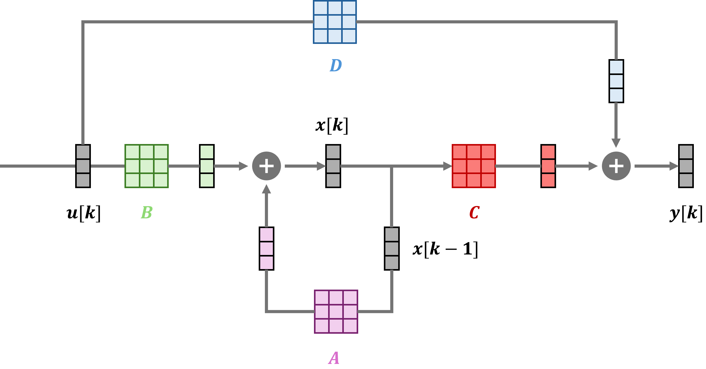
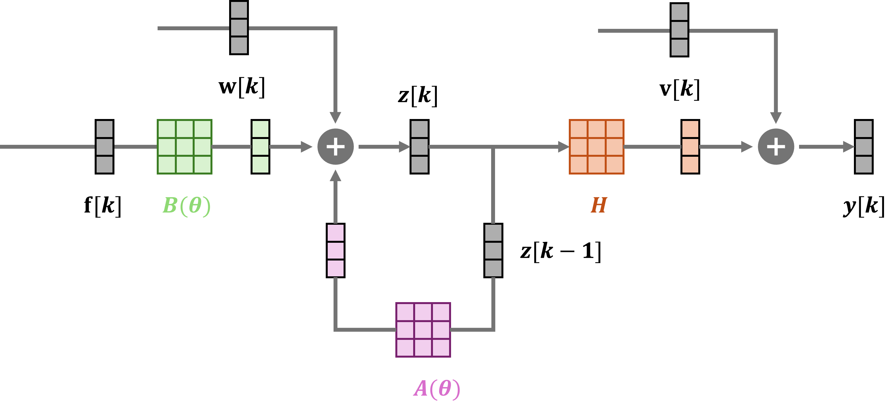

# __结构健康监测__

## I. SHM 与基础模型

### 1.1 SHM 简介  
结构健康监测（Structural Health Monitoring, SHM）的目标是在役结构的安全评估、寿命预测和运维优化。通过在结构上布设传感器、长期采集振动和响应数据，并结合模型和算法，对结构状态和潜在损伤进行识别与监测。

### 1.2 结构动力学基础模型  
多自由度结构可写成矩阵形式

\[
\mathbf{M}\ddot{\mathbf{x}}(t) + \mathbf{C}\dot{\mathbf{x}}(t) + \mathbf{K}\mathbf{x}(t) = \mathbf{f}(t) \tag{1}
\]

符号含义：

- \(\mathbf{x}(t),\dot{\mathbf{x}}(t),\ddot{\mathbf{x}}(t) \in \mathbb{R}^n\)：位移、速度、加速度；
- \(\mathbf{M},\mathbf{C},\mathbf{K} \in \mathbb{R}^{n \times n}\)：质量矩阵、阻尼矩阵、刚度矩阵；
- \(\mathbf{f}(t) \in \mathbb{R}^n\)：外部荷载；
- \(n\)：自由度个数。

模态频率、阻尼比和模态振型由上述矩阵表征，是后续系统识别与模态分析的核心量。

### 1.3 状态空间模型  
线性定常系统可以写成状态空间形式。在连续时间下，

\[
\dot{\mathbf{x}}(t) = \mathbf{A}_c \mathbf{x}(t) + \mathbf{B}_c \mathbf{u}(t) \tag{2}
\]

\[
\mathbf{y}(t) = \mathbf{C}_c \mathbf{x}(t) + \mathbf{D}_c \mathbf{u}(t) \tag{3}
\]

**连续时间形式 (2)(3) 符号含义：**

- \(\mathbf{x}(t) \in \mathbb{R}^n\)：状态向量；
- \(\mathbf{u}(t) \in \mathbb{R}^m\)：输入向量；
- \(\mathbf{y}(t) \in \mathbb{R}^p\)：输出向量；
- \(\mathbf{A}_c,\mathbf{B}_c,\mathbf{C}_c,\mathbf{D}_c\)：连续时间状态矩阵、输入矩阵、输出矩阵、直接传递矩阵；
- \(n,m,p\)：状态、输入、输出的维数。

离散时间形式（\(k \in \mathbb{Z}\)）为

\[
\mathbf{x}[k] = \mathbf{A}_d \mathbf{x}[k-1] + \mathbf{B}_d \mathbf{u}[k] \tag{4}
\]

\[
\mathbf{y}[k] = \mathbf{C}_d \mathbf{x}[k] + \mathbf{D}_d \mathbf{u}[k] \tag{5}
\]

**离散时间形式 (4)(5) 符号含义：**

- \(\mathbf{x}[k],\mathbf{u}[k],\mathbf{y}[k]\)：第 \(k\) 步的状态、输入、输出；
- \(\mathbf{A}_d,\mathbf{B}_d,\mathbf{C}_d,\mathbf{D}_d\)：由连续时间离散化得到的系统矩阵；
- \(k\)：离散时间步指标。

  
*图 1：状态空间模型的方框图表示。*

在 SHM 中，常将位移与速度组成结构状态 \(\mathbf{z}(t) = [\mathbf{x}(t)^\top,\dot{\mathbf{x}}(t)^\top]^\top\)，在离散时间下使用参数化形式

\[
\mathbf{z}[k] = \mathbf{A}(\theta)\,\mathbf{z}[k-1] + \mathbf{B}(\theta)\,\mathbf{f}[k] \tag{6}
\]

\[
\mathbf{y}[k] = \mathbf{H}\mathbf{z}[k] + \mathbf{v}[k] \tag{7}
\]

**SHM 参数化形式 (6)(7) 符号含义：**

- \(\mathbf{z}[k]\)：离散时刻的结构状态（位移与速度的堆叠）；
- \(\theta = \{\mathbf{M},\mathbf{C},\mathbf{K}\}\)：结构参数（质量、阻尼、刚度矩阵）；
- \(\mathbf{A}(\theta),\mathbf{B}(\theta)\)：由 \(\theta\) 决定的状态矩阵与输入矩阵；
- \(\mathbf{f}[k]\)：离散时刻的外部荷载；
- \(\mathbf{H}\)：观测矩阵（由传感器类型与布设决定）；
- \(\mathbf{v}[k]\)：测量噪声。

该紧凑模型是 SHM 中系统与模态识别的基础。

下图给出了该状态空间模型的方框图表示，以及在 SHM 场景下引入参数向量 \(\theta\) 与测量算子 \(\mathbf{H}\) 后的形式：

  
*图 2：SHM 场景下带参数与测量算子的状态空间模型。*

---

## II. 常用系统/模态识别方法

以下为常见、经典且值得重点学习的系统/模态识别方法；每项先简述核心原理，再说明典型适用场景。

### 2.1 PP

- **方法全称**：Peak Picking（峰值拾取，PP）。  
- **核心原理**：在响应功率谱或傅里叶谱上直接读取主峰对应的频率，并由多测点幅值比估计振型。  
- **适用场景**：模态较稀疏、阻尼较小、信噪比良好的初步估计或快速筛查。  
- **边缘计算**：适用。优点：仅需 FFT 与寻峰，计算与存储极低，易实时。缺点：精度与稳健性差，易受噪声与密模态影响。

### 2.2 ARX / ARMAX（PEM）

- **方法全称**：ARX / ARMAX 与预测误差法（Prediction-Error Methods, PEM）。  
- **核心原理**：用差分方程（ARX/ARMAX 等）描述输入–输出关系，通过最小化一步 ahead 预测误差估计模型参数，进而可得到模态参数。  
- **适用场景**：有输入–输出数据且需参数化模型的控制与系统识别；也可在输出仅情形下用 AR/ARMA 类模型。  
- **边缘计算**：较适用。优点：模型紧凑，数据量可控，低阶时运算量不大。缺点：阶次选取敏感，MLE 迭代可能较重，数值稳定性依赖实现。

### 2.3 FRF

- **方法全称**：FRF curve fitting（频响函数拟合，FRF）；常用实现如有理分式多项式（RFP）等。  
- **核心原理**：在频域用有理函数（或正交多项式）拟合实测 FRF，通过极点/留数提取模态频率、阻尼比与振型。  
- **适用场景**：有已知激励的实验室模态试验（锤击、激振器），需要较精确的模态参数时。  
- **边缘计算**：一般。优点：频域拟合可限制在感兴趣频段，降阶拟合可减算力。缺点：需已知激励与 FRF 估计，有理拟合与求根对资源有要求，多通道全频段较吃资源。

### 2.4 Transfer function fitting（传递函数拟合）

- **方法全称**：Transfer function fitting（传递函数拟合，TF fitting）。  
- **核心原理**：用有理传递函数（如 \(H(s)=N(s)/D(s)\) 或频域多项式比）拟合实测 FRF 或输入–输出频域数据，从拟合模型的极点与留数提取模态频率、阻尼比与振型。  
- **适用场景**：已有 FRF 或频域数据（如锤击/激振器试验后）；作为 FRF 估计的后续步骤得到参数化模态模型，常用于经典模态分析。  
- **边缘计算**：一般。优点：可限定频段、降阶拟合以减算力。缺点：需 FRF 或频域数据；有理拟合与求根多需迭代或非线性优化，多通道全频段较吃资源。

### 2.5 FDD / EFDD

- **方法全称**：Frequency Domain Decomposition / Enhanced FDD。  
- **核心原理**：对输出功率谱密度矩阵做奇异值分解，用主奇异向量近似振型，主奇异值曲线峰值对应频率；EFDD 在频域单模态段拟合以改进阻尼估计。  
- **适用场景**：仅测响应、不测激励的运行模态分析（如环境激励下的桥梁、楼宇）。  
- **边缘计算**：较适用。优点：输出仅即可，按频线 SVD 可分批处理；通道与频线不多时算力可接受。缺点：需缓存做 PSD；EFDD 阻尼拟合增加一步计算。

### 2.6 随机减量法（RDT / RDM）

- **方法全称**：Random Decrement Technique / Random Decrement Method（随机减量法，RDT / RDM）。  
- **核心原理**：在环境激励下的长时程输出响应中，按触发条件（如阈值/零交叉）截取大量短片段并求平均，使随机激励项相互抵消，从而得到近似的 **自由衰减特征响应**（等效脉冲响应）；据此可估计模态频率与阻尼（多通道时也可得到振型）。  
- **适用场景**：仅输出运行模态分析中，希望从环境数据中获得更"干净"的自由衰减信号；常作为 **NExT/ERA** 的预处理步骤，或用于阻尼的简化估计。  
- **边缘计算**：较适用。优点：主要是缓存 + 触发 + 叠加平均，无重优化。缺点：需要足够数据做平均；触发阈值与条件会影响质量；多通道会增加内存与带宽压力。

### 2.7 ERA / NExT-ERA

- **方法全称**：Eigensystem Realization Algorithm / Natural Excitation Technique – ERA（特征系统实现算法 / NExT-ERA）。  
- **核心原理**：ERA 由脉冲响应或自由衰减构造 Markov 参数与 Hankel 矩阵，经 SVD 与最小实现得到状态空间并提取模态；NExT-ERA 在环境激励下用输出的自/互相关构造等效脉冲响应，再对之应用 ERA。  
- **适用场景**：ERA 适用于有脉冲或自由衰减的试验；NExT-ERA 适用于仅测响应、不测激励的运行模态分析（如桥梁、楼宇等大型结构）。  
- **边缘计算**：较适用。优点：输出仅，Hankel 规模可限；单次 SVD 为主，无迭代。缺点：相关估计需缓存；阶次选取与多阶试算会增计算量。

### 2.8 SSI

- **方法全称**：Stochastic Subspace Identification（SSI：SSI-COV / SSI-DATA）。  
- **核心原理**：从输出（或输入–输出）的 Hankel/Toeplitz 块矩阵构造投影，用 SVD 得到可观/可控子空间，再恢复离散状态空间矩阵并从中提取模态。  
- **适用场景**：输出仅或输入–输出均可；长数据、多测点下稳健的模态识别，工程 OMA 中应用广泛。  
- **边缘计算**：不太适用。优点：识别效果最佳、工程常用。缺点：大 Hankel、大 SVD，多阶次稳定图试算，计算与内存需求高，低功耗边缘设备压力大；可做降维或云端协同以减轻边缘负担。

### 2.9 BAYOMA

- **方法全称**：Bayesian Operational Modal Analysis（贝叶斯运行模态分析，BAYOMA）。  
- **核心原理**：在输出仅情形下，将模态参数视为随机变量，用贝叶斯推断（如 MCMC、变分或 Laplace 近似）从响应数据估计其后验分布，得到模态参数估计及不确定性（置信区间等）。  
- **适用场景**：输出仅 OMA，且需要模态参数的不确定性量化或置信区间时；可与 SSI、FDD 等点估计方法互补。  
- **边缘计算**：不太适用。优点：提供后验与不确定性，利于风险评估与决策。缺点：贝叶斯计算（MCMC 等）重，算力与内存需求高，通常适合离线或云端。

---

## III. 损伤评估方法

以下按「先判定、再定位、再量化」的顺序罗列常见损伤评估方法；每项标明所解决的维度（判定 / 定位 / 量化）。

### 3.1 模态参数变化与基线比较

- **核心思路**：将当前识别得到的模态频率、阻尼比或振型与健康基线比较，构造标量或向量指标（如频率漂移、阻尼变化），再通过阈值或简单统计检验判断是否异常。
- **适用场景**：已有健康基线、需快速判断是否存在损伤或明显变化时。
- **解决维度**：判定；可辅助粗略量化（如“变化幅度”）。  
- **边缘计算**：适用。优点：仅比较与阈值，计算与存储极低。缺点：依赖基线质量，简单指标可能漏检。
- **在线/离线**：适合在线计算（实时比较即可）。

### 3.2 基于响应/特征的异常检测

- **核心思路**：不显式用模态参数，而是用多通道响应的统计特征（如 PCA 残差、协方差变化、马氏距离）或 novelty 指标，与基线分布比较，超出阈值即判为异常。
- **适用场景**：测点较多、希望数据驱动、不依赖精确模态识别时。
- **解决维度**：判定。  
- **边缘计算**：较适用。优点：基线/模型可离线训练，在线只做投影与阈值比较。缺点：多通道时协方差或 PCA 有计算量。
- **在线/离线**：基线离线、检测可在线；或全离线。

### 3.3 MAC 与振型类指标

- **核心思路**：用模态置信度（MAC）、振型差、振型斜率等度量当前振型与基线的差异；空间上差异大的区域或参与度变化的模态可提示损伤位置。
- **适用场景**：已有多阶振型估计、需从振型变化判断损伤并大致定位时。
- **解决维度**：判定、定位。  
- **边缘计算**：较适用。优点：MAC 等为内积与范数，计算轻。缺点：需当前振型，若在线则依赖在线模态识别。
- **在线/离线**：可在线（若模态在线估计）或离线。

### 3.4 柔度/刚度矩阵法

- **核心思路**：柔度与刚度在缩减自由度上互为逆；由识别出的模态参数（频率、振型及质量近似）可构造柔度矩阵，或求逆得刚度矩阵。损伤导致刚度降、柔度增，比较当前与基线柔度或刚度（或其变化向量），变化显著的位置即可能损伤区域，并可辅助量化刚度折减。
- **适用场景**：已知多阶模态且可近似质量分布时；对梁、框架等结构常用；表达形式可选柔度或刚度，本质同一。
- **解决维度**：判定、定位；可辅助量化。  
- **边缘计算**：一般。优点：物理意义清晰，矩阵规模不大时可行。缺点：需多阶模态与质量近似，矩阵运算或求逆。
- **在线/离线**：多用于离线；轻量化后可在线。

### 3.5 曲率与应变模态

- **核心思路**：由位移振型求曲率（或应变模态）；损伤处刚度局部下降，曲率或应变在该处出现突变或异常峰值，据此定位损伤。
- **适用场景**：测点较密、梁或板类结构、需局部定位时。
- **解决维度**：定位。  
- **边缘计算**：较适用。优点：曲率由振型差分或拟合，计算量不大，易分布式。缺点：需较密测点与振型估计。
- **在线/离线**：可在线（若振型在线）或离线。

### 3.6 模型更新与刚度反演

- **核心思路**：建立参数化有限元或简化模型（如单元刚度折减系数），以当前测试数据（模态、响应等）为约束，通过优化或贝叶斯反演估计刚度折减等参数，得到损伤位置与程度。
- **适用场景**：有可靠结构模型、需定量评估损伤位置与严重程度时。
- **解决维度**：判定、定位、量化。  
- **边缘计算**：不太适用。优点：可定量。缺点：优化/反演迭代重，计算与内存需求高。
- **在线/离线**：适合离线计算；在线通常需云端或强算力节点。

---

## IV. 实验模态分析教学视频

Amirali Najafi 系列

<iframe width="800" height="450" src="https://www.youtube-nocookie.com/embed/Og_VZ-PiBdM" frameborder="0" allowfullscreen></iframe>

NPTEL IIT Delhi 系列

<iframe width="800" height="450" src="https://www.youtube-nocookie.com/embed/tzhSU9CTl08" frameborder="0" allowfullscreen></iframe>

## V. 相关链接

-   :material-file:{ .lg .middle } __常用环境激励模态识别方法__

    ---

    知乎

    [:octicons-arrow-right-24: <a href="https://zhuanlan.zhihu.com/p/644013127" target="_blank"> 传送门 </a>](#)

