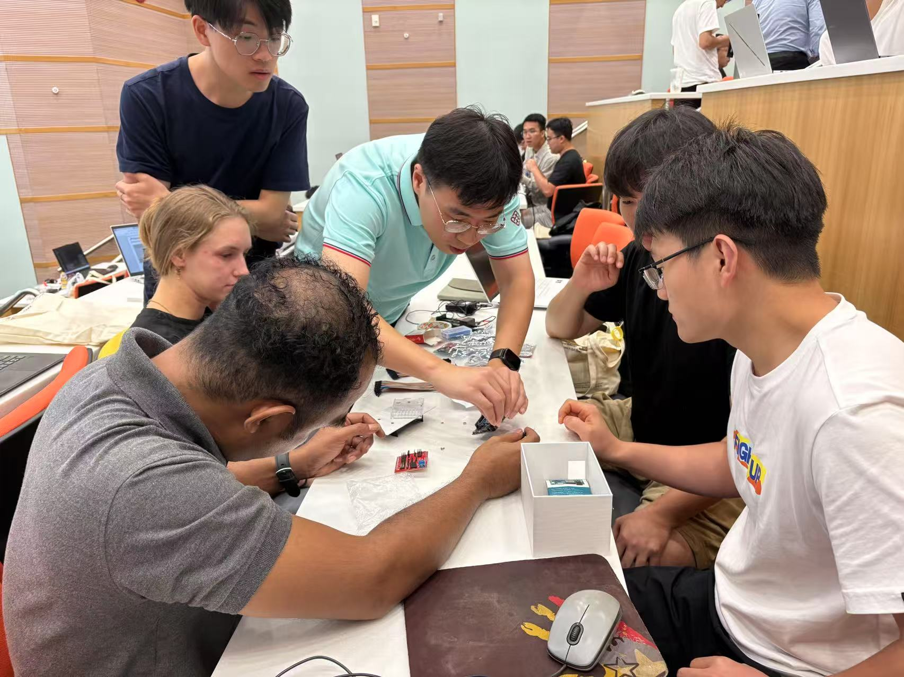
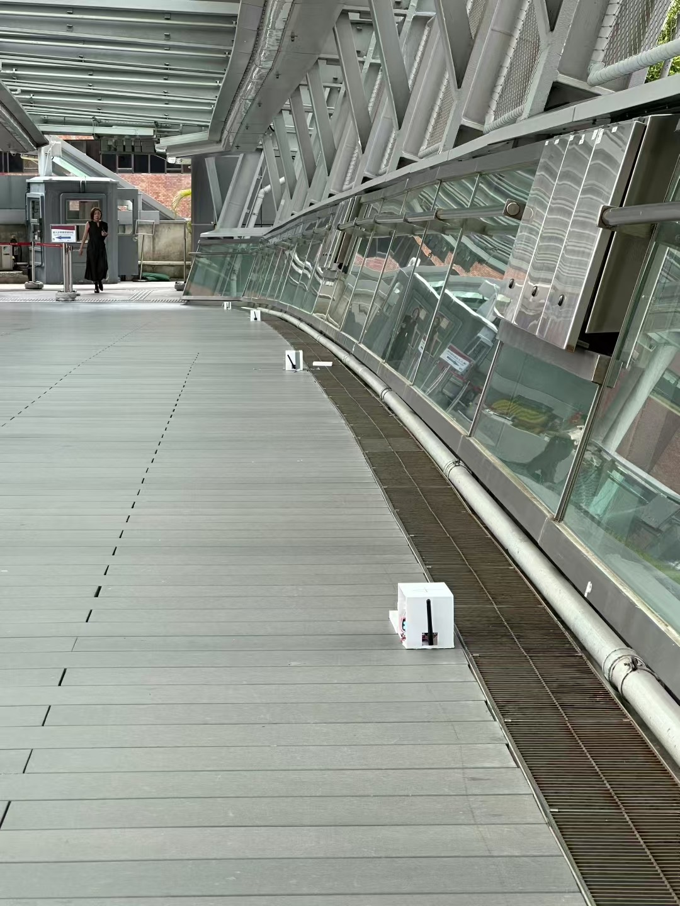
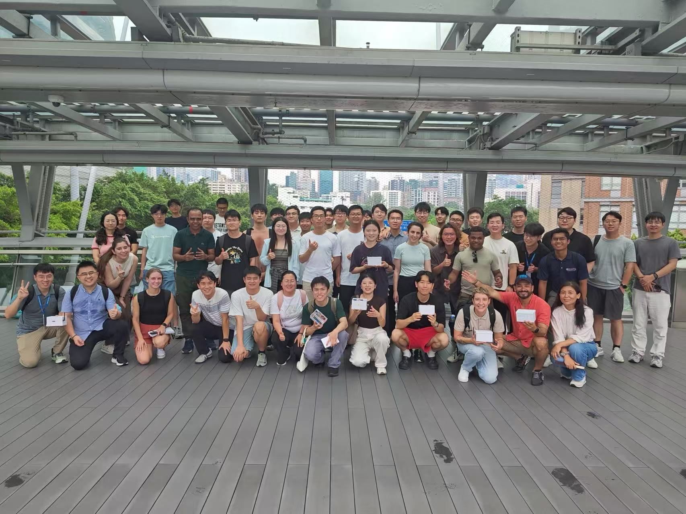

# PROJECT

!!! quote
    Knowledge broadens the mind, but experience deepens the soul.

## NEXUSIA

-   :simple-github:{ .lg .middle } __NexNode__

    ---

    **FRONTEND/EDGE** 
    
    General Purpose MCU AIoT Node.

    [:octicons-arrow-right-24: <a href="https://github.com/Shuaiwen-Cui/NexNode.git" target="_blank"> Repository </a>](#)

    [:octicons-arrow-right-24: <a href="https://shuaiwen-cui.github.io/NexNode/" target="_blank"> Online Doc </a>](#)

-   :simple-github:{ .lg .middle } __NexHub__

    ---

    **BACKEND/CLOUD** 
    
    AI-Powered IoT Cloud Platform.

    [:octicons-arrow-right-24: <a href="https://github.com/Shuaiwen-Cui/NexHub.git" target="_blank"> Repository </a>](#)

    [:octicons-arrow-right-24: <a href="https://shuaiwen-cui.github.io/NexHub/" target="_blank"> Online Doc </a>](#)

## AUTORA

-   :simple-github:{ .lg .middle } __TinyAuton__

    ---

    Library for building intelligent agents on MCU devices, coving mathematics, DSP, and AI.

    [:octicons-arrow-right-24: <a href="https://github.com/Shuaiwen-Cui/TinyAuton.git" target="_blank"> Repository </a>](#)

    [:octicons-arrow-right-24: <a href="https://shuaiwen-cui.github.io/TinyAuton/" target="_blank"> Online Doc </a>](#)

## ARDUINONODE

A simple WSN node developed for SHM teaching, based on Arduino UNO R4 WIFI, successfully used in the APESS2025 Summer School held at The Hong Kong Polytechnic University.

