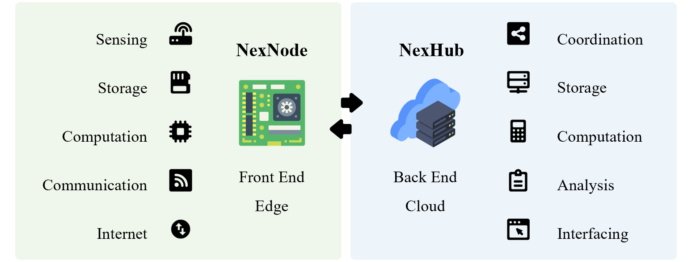
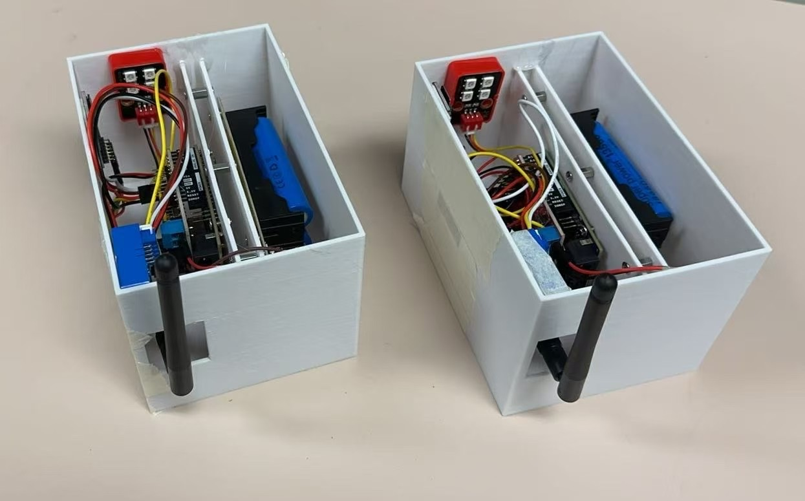
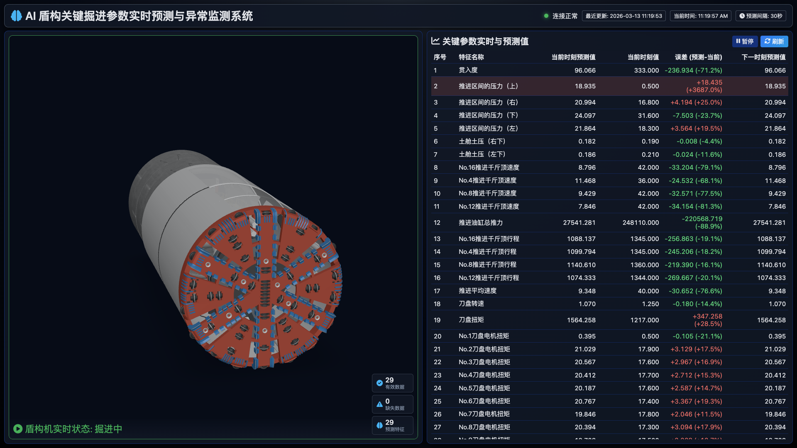
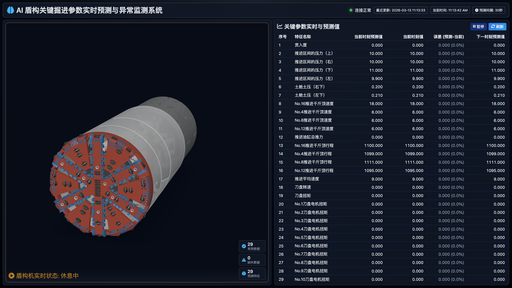

# PROJECT

!!! quote
    Knowledge broadens the mind, but experience deepens the soul.

## NEXUSIA

-   :simple-github:{ .lg .middle } __NexNode__

    ---

    **FRONTEND/EDGE** 
    
    General Purpose MCU AIoT Node.

    [:octicons-arrow-right-24: <a href="https://github.com/Shuaiwen-Cui/NexNode.git" target="_blank"> Repository </a>](#)

    [:octicons-arrow-right-24: <a href="http://www.cuishuaiwen.com:9100/" target="_blank"> Online Doc (Hosted on Personal Server) </a>](#)

    [:octicons-arrow-right-24: <a href="https://shuaiwen-cui.github.io/NexNode/" target="_blank"> Online Doc (Hosted on Github Pages)  </a>](#)

-   :simple-github:{ .lg .middle } __NexHub__

    ---

    **BACKEND/CLOUD** 
    
    AI-Powered IoT Cloud Platform.

    [:octicons-arrow-right-24: <a href="https://github.com/Shuaiwen-Cui/NexHub.git" target="_blank"> Repository </a>](#)

    [:octicons-arrow-right-24: <a href="http://www.cuishuaiwen.com:9200/" target="_blank"> Online Doc (Hosted on Personal Server) </a>](#)

    [:octicons-arrow-right-24: <a href="https://shuaiwen-cui.github.io/NexHub/" target="_blank"> Online Doc (Hosted on Github Pages) </a>](#)

## AUTORA

-   :simple-github:{ .lg .middle } __TinyAuton__

    ---

    Library for building intelligent agents on MCU devices, coving mathematics, DSP, and AI.

    [:octicons-arrow-right-24: <a href="https://github.com/Shuaiwen-Cui/TinyAuton.git" target="_blank"> Repository </a>](#)

    [:octicons-arrow-right-24: <a href="http://www.cuishuaiwen.com:9300/" target="_blank"> Online Doc (Hosted on Personal Server) </a>](#)

    [:octicons-arrow-right-24: <a href="https://shuaiwen-cui.github.io/TinyAuton/" target="_blank"> Online Doc (Hosted on Github Pages) </a>](#)

## ARDUINONODE

A simple WSN node developed for SHM teaching, based on Arduino UNO R4 WIFI, successfully used in the APESS2025 Summer School held at The Hong Kong Polytechnic University.

-   :simple-github:{ .lg .middle } __ArduinoNode__

    ---

    SHM Teaching WSN Node Based on Arduino UNO R4 WIFI

    [:octicons-arrow-right-24: <a href="https://github.com/Shuaiwen-Cui/ArduinoNode.git" target="_blank"> Code </a>](#)

    [:octicons-arrow-right-24: <a href="https://shuaiwen-cui.github.io/ArduinoNode/" target="_blank"> Online Doc </a>](#)

## TBM MULTIVARIATE TIME SERIES REAL-TIME PREDICTION SYSTEM

<model-viewer
    src="../../static/models/TBM.glb"
    alt="TBM 3D model"
    camera-controls
    auto-rotate
    auto-rotate-delay="3000"
    rotation-per-second="1deg"
    interaction-prompt="none"
    shadow-intensity="0.6"
    exposure="0.5"
    environment-image="legacy"
    orientation="0deg 0deg 60deg"
    ar
    ar-modes="webxr scene-viewer quick-look"
    style="width: 100%; height: 600px;">
</model-viewer>

*Boring*

*Resting*

-   :simple-github:{ .lg .middle } __TBM Multivariate Time Series Real-Time Prediction System__

    ---

    [:octicons-arrow-right-24: <a href="http://8.141.92.6:5001/" target="_blank"> Project Link </a>](#)

