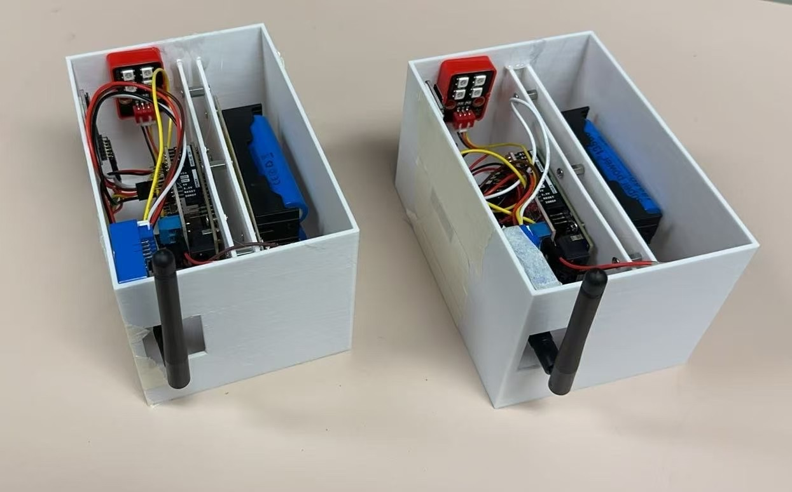

# 项目

!!! quote
    知识使人渊博，经验使人深刻。

## NEXUSIA - 互联之境

-   :simple-github:{ .lg .middle } __NexNode__

    ---

    **前端部分/边缘部分**

    通用 MCU AIoT 节点。

    [:octicons-arrow-right-24: <a href="https://github.com/Shuaiwen-Cui/NexNode.git" target="_blank"> 代码 </a>](#)

    [:octicons-arrow-right-24: <a href="http://www.cuishuaiwen.com:9100/" target="_blank"> 在线文档（个人服务器 托管） </a>](#)

    [:octicons-arrow-right-24: <a href="https://shuaiwen-cui.github.io/NexNode/" target="_blank"> 在线文档（Github 托管） </a>](#)
    

-   :simple-github:{ .lg .middle } __NexHub__

    ---

    **后端部分/云端部分**

    AI 驱动的 IoT 云平台。

    [:octicons-arrow-right-24: <a href="https://github.com/Shuaiwen-Cui/NexHub.git" target="_blank"> 代码 </a>](#)

    [:octicons-arrow-right-24: <a href="http://www.cuishuaiwen.com:9200/" target="_blank"> 在线文档（个人服务器 托管） </a>](#)

    [:octicons-arrow-right-24: <a href="https://shuaiwen-cui.github.io/NexHub/" target="_blank"> 在线文档（Github 托管） </a>](#)

## AUTORA - 自动纪元

-   :simple-github:{ .lg .middle } __TinyAuton__

    ---

    用于在 MCU 设备上构建智能体的库, 涵盖数学、数字信号处理 和 AI。

    [:octicons-arrow-right-24: <a href="https://github.com/Shuaiwen-Cui/TinyAuton.git" target="_blank"> 代码 </a>](#)

    [:octicons-arrow-right-24: <a href="http://www.cuishuaiwen.com:9300/" target="_blank"> 在线文档（个人服务器 托管） </a>](#)

    [:octicons-arrow-right-24: <a href="https://shuaiwen-cui.github.io/TinyAuton/" target="_blank"> 在线文档（Github 托管） </a>](#)

## ARDUINONODE

针对SHM教学开发的简单WSN节点，基于Arduino UNO R4 WIFI， 成功用在香港理工大学举办的APESS2025暑期学校中。

-   :simple-github:{ .lg .middle } __ArduinoNode__

    ---

    SHM教学用WSN节点--基于Arduino UNO R4 WIFI

    [:octicons-arrow-right-24: <a href="https://github.com/Shuaiwen-Cui/ArduinoNode.git" target="_blank"> 代码 </a>](#)

    [:octicons-arrow-right-24: <a href="https://shuaiwen-cui.github.io/ArduinoNode/" target="_blank"> 在线文档 </a>](#)

