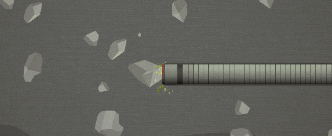
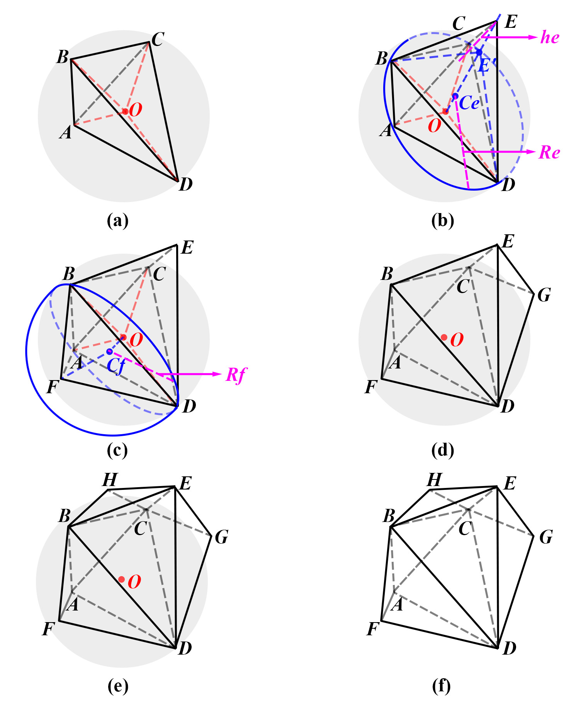
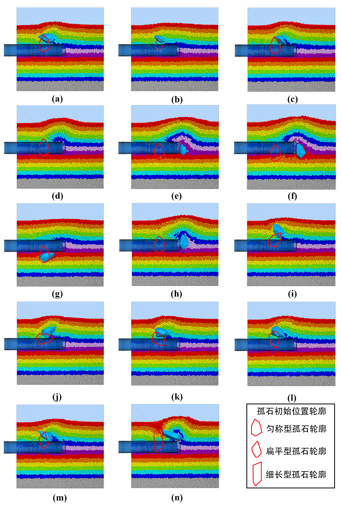
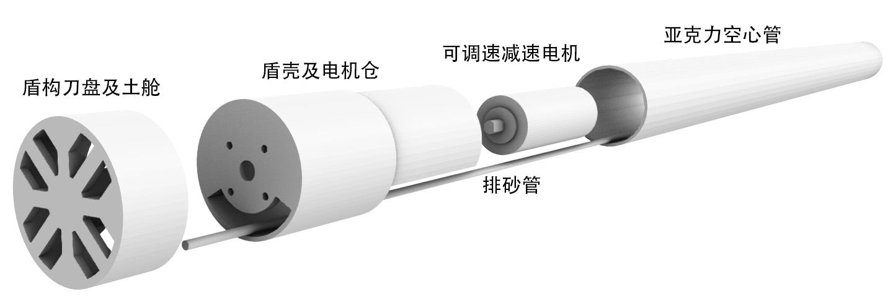
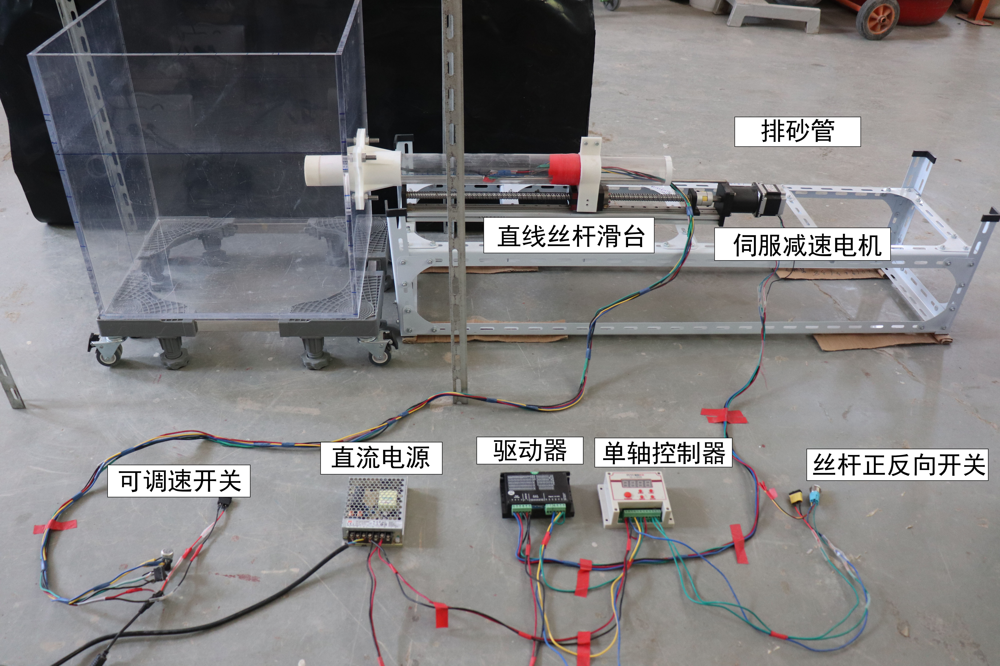

# __M.ENG. STUDIES__

{width=100%}

!!! info "RESEARCH TOPICS"
    My M.Eng. research topic is __Algorithm for Random Generation of 3D Mesoscopic Shape of Granular Materials along with Its Application to TBM Tunnelling in Stratum with Boulders__, focusing on the development of a novel algorithm for the generation of 3D polyhedrons for the simulation of rock particles by Discrete Element Method (DEM) and its application to tunneling in a boulder-soil matrix.

!!! info "KEY TASKS"
    - Developed a novel algorithm for the generation of 3D polyhedrons
    - DEM simulation of TBM tunneling in a boulder-soil matrix
    - Experimental validation by devising a mini TBM tunneling test

-   :material-file:{ .lg .middle } __Journal Paper - Tunnelling and Underground Space Technology__

    ---

    Algorithm for generation of 3D polyhedrons for simulation of rock particles by DEM and its application to tunneling in boulder-soil matrix.

    [:octicons-arrow-right-24: <a href="https://doi.org/10.1016/j.tust.2020.103588" target="_blank"> Portal </a>](#)

## __Algorithm for Random Polyhedron Generation__

{width=100%}

## __DEM Simulation of TBM Tunneling__

{width=100%}

## __EXPERIMENTAL VALIDATION__

{width=100%}

{width=100%}