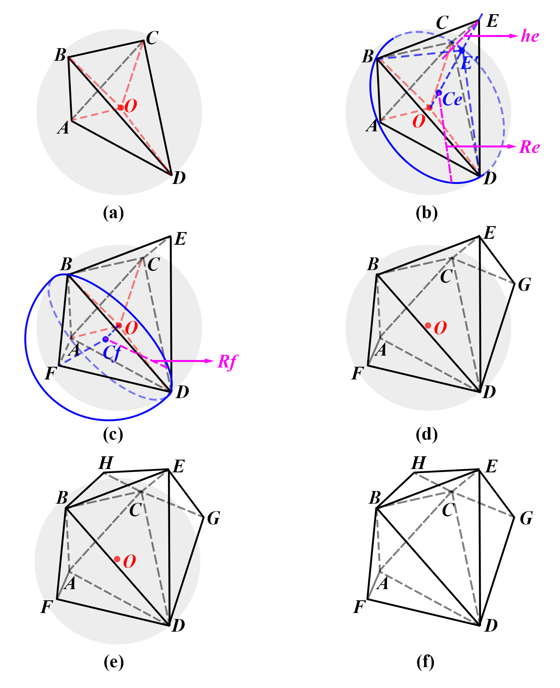
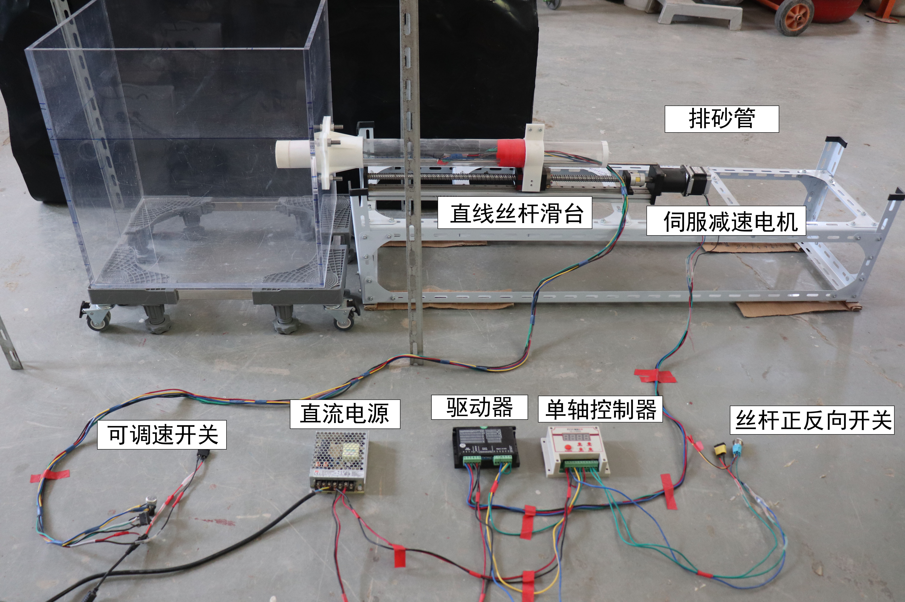

## __读硕期间研究__

{width=100%}

!!! info "研究主题"
    我的硕士研究课题是 __颗粒材料三维细观形状随机生成算法及其在孤石地层盾构掘进中的应用__，重点是开发一种三维多面体的随机生成的算法，并将其应用于在孤石地层中的隧道掘进的研究中，以考察对地层的影响。

!!! info "主要任务"
    - 开发了一种三维多面体的随机生成算法
    - 在孤石地层中进行盾构掘进的离散元模拟
    - 通过设计迷你盾构掘进试验进行实验验证

-   :material-file:{ .lg .middle } __期刊论文 - Tunnelling and Underground Space Technology__
    
    ---
    
    Cui, S., Tan, Y., & Lu, Y. (2020). Algorithm for generation of 3D polyhedrons for simulation of rock particles by DEM and its application to tunneling in boulder-soil matrix. Tunnelling and Underground Space Technology, 106, 103588.
    
    [:octicons-arrow-right-24: <a href="https://doi.org/10.1016/j.tust.2020.103588" target="_blank"> 传送门 </a>](#)

## __随机多面体生成算法__

{width=100%}

## __盾构掘进的离散元模拟__

{width=100%}

## __实验验证__

{width=100%}

{width=100%}

<iframe width="800" height="450" src="https://www.youtube-nocookie.com/embed/ZqYrFJc2pJ8" frameborder="0" allowfullscreen></iframe>
