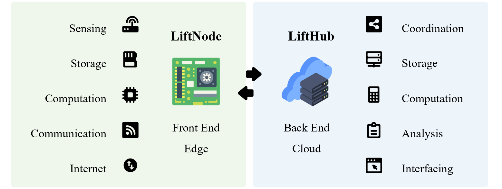
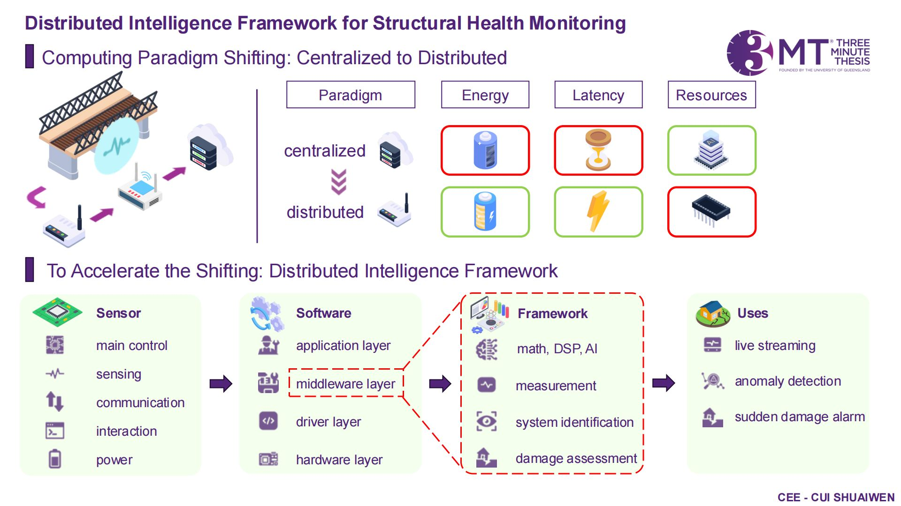
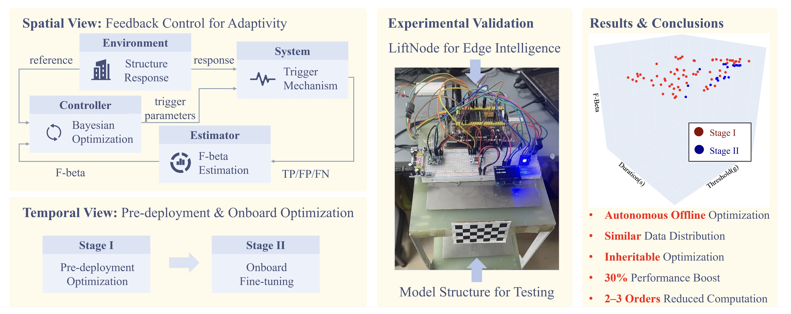
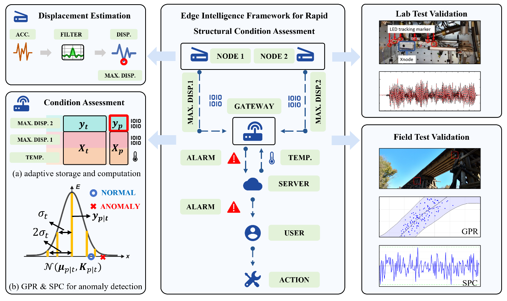

# __PH.D. STUDIES__

{width=100%}

!!! info "RESEARCH TOPICS -- PUSHING STRUCTURAL HEALTH MONITORING TO THE EDGE DEVICES"
    My Ph.D. research topic is __Distributed Edge Intelligence Enabling Framework for IoT-based Structural Health Monitoring: TinySHM__, focusing on developing a distributed edge intelligence enabling framework which is specially designed for low-cost and resource-constrained edge devices in IoT-based structural health monitoring. 

!!! info "KEY TASKS"
    - IoT System Development: Edge Device (MCU Level, Low-cost & Resource-constrained) and Cloud Platform Development
    - Distributed Edge Intelligence Enabling Framework Development: TinySHM (Vector & Matrix Operations / Digital Signal Processing / Machine Learning & Artificial Intelligence Libraries)
    - Structural Health Monitoring Applications: Measurement / System Identification / Damage Detection / Damage Localization / Damage Evaluation

## __I IoT System Development__

{width=100%}

### __1.1 Edge Device__

!!! note "Edge Device Development"
    To achieve edge intelligence computing, we have developed two types of MCU nodes, based on STM32 and ESP32. These nodes have high-performance edge computing capabilities and can be used in IoT, smart home, smart city, and other application scenarios. The current development focus is on ESP32.

-   :simple-github:{ .lg .middle } __LiftNode_ESP32🎯🏆__

    ---

    MCU IoT Node with High Performance Edge Computing, Based on ESP32

    [:octicons-arrow-right-24: <a href="https://github.com/Shuaiwen-Cui/LiftNode_ESP32.git" target="_blank"> Code </a>](#)

    [:octicons-arrow-right-24: <a href="http://www.cuishuaiwen.com:8100/" target="_blank"> Online Doc (Hosted on Personal Server) </a>](#)

    [:octicons-arrow-right-24: <a href="https://shuaiwen-cui.github.io/LiftNode_ESP32/" target="_blank"> Online Doc (Hosted on Github Pages) </a>](#)

<iframe width="800" height="450" src="https://www.youtube-nocookie.com/embed/O2b3-Bjhhws" frameborder="0" allowfullscreen></iframe>

### __1.2 Cloud Platform__

-   :simple-github:{ .lg .middle } __LiftHub 🎯🏆__

    ---

    Acts as the server-side to interact with LiftNode, providing data storage and analysis functions.

    [:octicons-arrow-right-24: <a href="https://github.com/Shuaiwen-Cui/LiftHub.git" target="_blank"> Code </a>](#)

    [:octicons-arrow-right-24: <a href="http://www.cuishuaiwen.com:8200/" target="_blank"> Online Doc (Hosted on Personal Server) </a>](#)

    [:octicons-arrow-right-24: <a href="https://shuaiwen-cui.github.io/LiftHub/" target="_blank"> Online Doc (Hosted on Github Pages) </a>](#)

## __II Distributed Edge Intelligence Enabling Framework__

{width=100%}

-   :simple-github:{ .lg .middle } __TinySHM🎯🏆__

    ---

    Currently Supported Platforms:

    - ESP32

    [:octicons-arrow-right-24: <a href="https://github.com/Shuaiwen-Cui/TinySHM.git" target="_blank"> Code </a>](#)

    [:octicons-arrow-right-24: <a href="http://www.cuishuaiwen.com:8300/" target="_blank"> Online Doc (Hosted on Personal Server) </a>](#)

    [:octicons-arrow-right-24: <a href="https://shuaiwen-cui.github.io/TinySHM/" target="_blank"> Online Doc (Hosted on Github Pages) </a>](#)

## __III Structural Health Monitoring Applications__

### __3.1 Single-Node Independent Applications__

**- Smart Adaptive Trigger Sensing Powered by Edge Intelligence and Digital Twin for Energy-Efficient Wireless Structural Health Monitoring**

🏷️ SHM Category: **Measurement** / System Identification / Damage Detection / Damage Localization / Damage Evaluation

- Trigger Sensing
- Closed-Loop Feedback Control
- Edge Intelligence
- Bayesian Optimization

-   :material-file:{ .lg .middle } __Conference Paper - 13th International Conference on Structural Health Monitoring of Intelligent Infrastructure (SHMII-13)__

    ---

    **Cui, S.**, Yu, X., & Fu, Y.* (2025). Smart adaptive triggering strategy for edge intelligence enabled energy-efficient sensing. In *Proceedings of the 13th International Conference on Structural Health Monitoring of Intelligent Infrastructure (SHMII-13)*, pp. 609–616. Graz, Austria: Verlag der TU Graz. (🏆 **Best Conference Paper Award** 1st/202)

    [:octicons-arrow-right-24: <a href="https://doi.org/10.3217/978-3-99161-057-1-094" target="_blank"> DOI </a>](#)

-   :material-file:{ .lg .middle } __Journal Paper - Mechanical System and Signal Processing__

    ---

    **Cui, S.**, Fu, Y.*, Fu, H., Yu, X., & Shen, W. (2025). Smart Adaptive Trigger Sensing Powered by Edge Intelligence and Digital Twin for Energy-Efficient Wireless Structural Health Monitoring. Mechanical Systems and Signal Processing. Mechanical Systems and Signal Processing, Volume 241, 2025, 113537.

    [:octicons-arrow-right-24: <a href="https://doi.org/10.1016/j.ymssp.2025.113537" target="_blank"> DOI </a>](#)

### __3.2 Multi-Node Collaborative Applications__

**- Adaptive edge intelligence for rapid structural condition assessment using a wireless smart sensor network**

🏷️ SHM Category: **Measurement** / System Identification /**Damage Detection** /**Damage Localization** /**Damage Evaluation**

- Data-driven Anomaly Detection
- Gaussian Process Regression (GPR)
- Stochastic Process Control (SPC)

{width=100%}

-   :material-file:{ .lg .middle } __Journal Paper - Engineering Structures__

    ---

    **Cui, S.**, Hoang, T., Mechitov, K., Fu, Y.*, & Spencer Jr, B. F. (2025). Adaptive edge intelligence for rapid structural condition assessment using a wireless smart sensor network. Engineering Structures, 326, 119520.

    [:octicons-arrow-right-24: <a href="https://doi.org/10.1016/j.engstruct.2024.119520" target="_blank"> Portal </a>](#)

<!-- ### __3.3 Damage Detection__ -->

