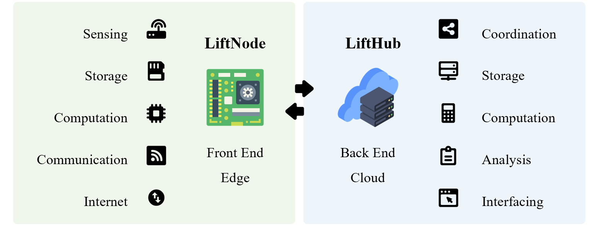
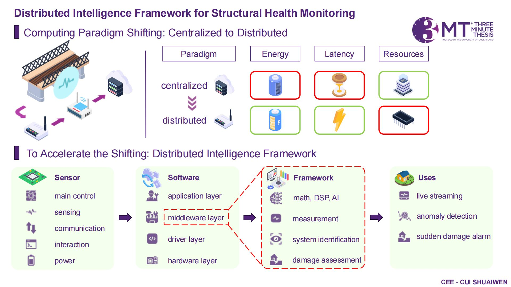
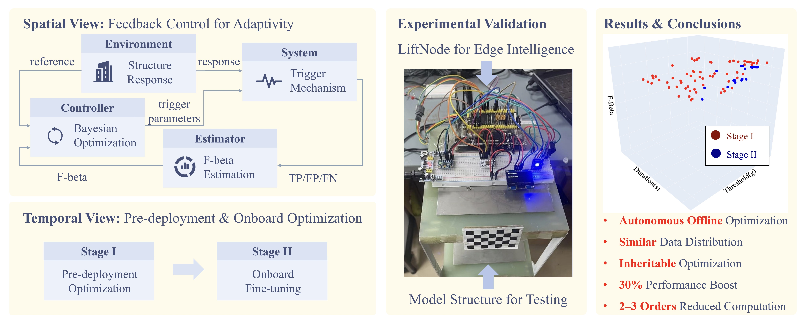

# __攻博期间研究__

{width=100%}

!!! info "研究主题 -- 将结构健康监测推向边缘设备"
    我的博士研究课题是 __面向物联网结构健康监测的分布式边缘智能框架__，重点是开发一种分布式边缘智能使能框架，专门为物联网结构健康监测中的低成本和资源受限的边缘设备设计。

!!! info "主要任务"
    - 物联网系统开发：边缘设备（MCU级别，低成本和资源受限）和云平台开发
    - 分布式边缘智能使能框架开发：TinySHM (向量、矩阵运算/数字信号处理/机器学习与人工智能算法库)
    - 结构健康监测应用：测量/系统识别/损伤检测/损伤定位/损伤量化

## __I 物联网系统开发__

{width=100%}

### __1.1 边缘设备__

!!! note "边缘设备开发"
    为实现边缘智能计算，我们开发了两种类型的 MCU 节点，基于 STM32 和 ESP32。这些节点具有高性能的边缘计算能力，可用于物联网、智能家居、智慧城市等应用场景。目前的开发重点是 ESP32。

-   :simple-github:{ .lg .middle } __LiftNode_ESP32🎯🏆__

    ---

    基于 ESP32 的 MCU IoT 节点，具有高性能边缘计算

    [:octicons-arrow-right-24: <a href="https://github.com/Shuaiwen-Cui/LiftNode_ESP32.git" target="_blank"> 代码 </a>](#)

    [:octicons-arrow-right-24: <a href="http://www.cuishuaiwen.com:8100/" target="_blank"> 在线文档（个人服务器 托管） </a>](#)

    [:octicons-arrow-right-24: <a href="https://shuaiwen-cui.github.io/LiftNode_ESP32/" target="_blank"> 在线文档（Github 托管） </a>](#)

<iframe width="800" height="450" src="https://www.youtube-nocookie.com/embed/O2b3-Bjhhws" frameborder="0" allowfullscreen></iframe>

### __1.2 云平台__

-   :simple-github:{ .lg .middle } __LiftHub 🎯🏆__

    ---

    作为服务器端与LiftNode交互，提供数据存储和分析等功能。

    [:octicons-arrow-right-24: <a href="https://github.com/Shuaiwen-Cui/LiftHub.git" target="_blank"> 代码 </a>](#)

    [:octicons-arrow-right-24: <a href="http://www.cuishuaiwen.com:8200/" target="_blank"> 在线文档（个人服务器 托管） </a>](#)

    [:octicons-arrow-right-24: <a href="https://shuaiwen-cui.github.io/LiftHub/" target="_blank"> 在线文档（Github 托管） </a>](#)

## __II 资源受限设备分布式边缘智能使能框架__

{width=100%}

-   :simple-github:{ .lg .middle } __TinySHM🎯🏆__

    ---

    当前支持平台：

    - ESP32

    [:octicons-arrow-right-24: <a href="https://github.com/Shuaiwen-Cui/TinySHM.git" target="_blank"> 代码 </a>](#)

    [:octicons-arrow-right-24: <a href="http://www.cuishuaiwen.com:8300/" target="_blank"> 在线文档（个人服务器 托管） </a>](#)

    [:octicons-arrow-right-24: <a href="https://shuaiwen-cui.github.io/TinySHM/" target="_blank"> 在线文档（Github 托管） </a>](#)

## __III 新兴的机器学习/人工智能驱动的典型结构健康监测应用__

### __3.1 单节点独立应用__

**- 基于边缘智能与数字孪生的智能自适应触发传感用于能源高效的无线结构健康监测**

🏷️ SHM分类：**测量**/系统识别/损伤检测/损伤定位/损伤量化

- 触发传感
- 闭环反馈控制
- 边缘智能
- 贝叶斯优化

-   :material-file:{ .lg .middle } __会议论文 - 13th International Conference on Structural Health Monitoring of Intelligent Infrastructure (SHMII-13)__

    ---

    **Cui, S.**, Yu, X., & Fu, Y.* (2025). Smart adaptive triggering strategy for edge intelligence enabled energy-efficient sensing. In *Proceedings of the 13th International Conference on Structural Health Monitoring of Intelligent Infrastructure (SHMII-13)*, pp. 609–616. Graz, Austria: Verlag der TU Graz. (🏆 **最佳会议论文** 1st/202)

    [:octicons-arrow-right-24: <a href="https://doi.org/10.3217/978-3-99161-057-1-094" target="_blank"> DOI </a>](#)

-   :material-file:{ .lg .middle } __期刊论文 - Mechanical System and Signal Processing__

    ---

    **Cui, S.**, Fu, Y.*, Fu, H., Yu, X., & Shen, W. (2025). Smart Adaptive Trigger Sensing Powered by Edge Intelligence and Digital Twin for Energy-Efficient Wireless Structural Health Monitoring.  Mechanical Systems and Signal Processing, Volume 241, 2025, 113537.

    [:octicons-arrow-right-24: <a href="https://doi.org/10.1016/j.ymssp.2025.113537" target="_blank"> DOI </a>](#)

    [:octicons-arrow-right-24: <a href="https://mp.weixin.qq.com/s/FnFBCZ_S0t8YfapvUsaKeQ" target="_blank"> 公众号推送 </a>](#)

-   :material-file:{ .lg .middle } __新加坡专利 - 10202502426R__

    ---

    Adaptive Triggering Mechanism for Time-Series Data Sensing on Edge Devices, 新加坡临时专利申请号 10202502426R, 2025

### __3.2 多节点协同应用__

**- 基于无线智能传感网络的自适应边缘智能用于结构快速状况评估**

🏷️ SHM分类：**测量**/系统识别/**损伤检测**/**损伤定位**/**损伤量化**

- 数据驱动的异常检测
- 高斯过程回归
- 随机过程控制

{width=100%}

-   :material-file:{ .lg .middle } __期刊论文 - Engineering Structures__

    ---

    **Cui, S.**, Hoang, T., Mechitov, K., Fu, Y.*, & Spencer Jr, B. F. (2025). Adaptive edge intelligence for rapid structural condition assessment using a wireless smart sensor network. Engineering Structures, 326, 119520.

    [:octicons-arrow-right-24: <a href="https://doi.org/10.1016/j.engstruct.2024.119520" target="_blank"> DOI </a>](#)

    [:octicons-arrow-right-24: <a href="https://mp.weixin.qq.com/s/KHquagqxXvckCuE57ua8YA" target="_blank"> 公众号推送 </a>](#)

<!-- ### __3.3 多智能体合作应用__ -->

