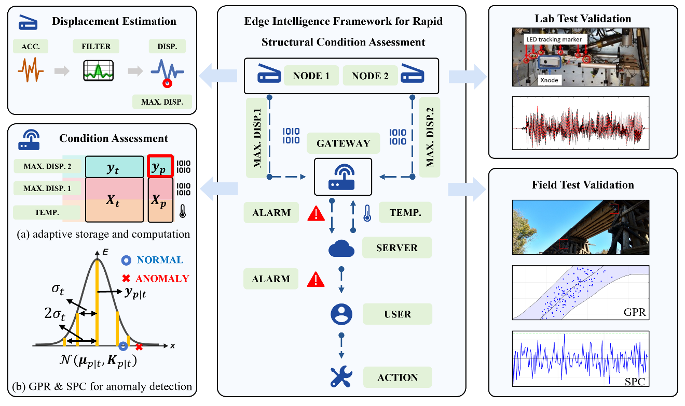

# __攻博期间研究__

{width=100%}

!!! info "研究主题 -- 将SHM推向边缘设备"
    我的博士研究课题是 __基于物联网的结构健康监测的分布式边缘智能支持框架：TinySHM__，重点是开发一种分布式边缘智能使能框架，专门为物联网结构健康监测中的低成本和资源受限的边缘设备设计。

!!! info "主要任务"
    - 物联网硬件原型设计：前端（MCU级别，低成本和资源受限）和后端开发
    - 分布式边缘智能使能框架开发：TinySHM
    - 结构健康监测应用：测量/系统识别/损伤检测/损伤定位/损伤量化

## __I 物联网硬件原型设计__

### __1.1 前端__

!!! note "硬件开发"
    为实现边缘智能计算，我们开发了两种类型的 MCU 节点，基于 STM32 和 ESP32。这些节点具有高性能的边缘计算能力，可用于物联网、智能家居、智慧城市等应用场景。目前的开发重点是 ESP32。

-   :simple-github:{ .lg .middle } __LiftNode_ESP32🎯🏆__

    ---

    基于 ESP32 的 MCU IoT 节点，具有高性能边缘计算

    [:octicons-arrow-right-24: <a href="https://github.com/Shuaiwen-Cui/LiftNode_ESP32.git" target="_blank"> 代码 </a>](#)

    [:octicons-arrow-right-24: <a href="http://www.cuishuaiwen.com:8100/" target="_blank"> 在线文档（个人服务器 托管） </a>](#)

    [:octicons-arrow-right-24: <a href="https://shuaiwen-cui.github.io/LiftNode_ESP32/" target="_blank"> 在线文档（Github 托管） </a>](#)

<iframe width="800" height="450" src="https://www.youtube-nocookie.com/embed/O2b3-Bjhhws" frameborder="0" allowfullscreen></iframe>

### __1.2 后端__

-   :simple-github:{ .lg .middle } __LiftHub 🎯🏆__

    ---

    作为服务器端与LiftNode交互，提供数据存储和分析等功能。

    [:octicons-arrow-right-24: <a href="https://github.com/Shuaiwen-Cui/LiftHub.git" target="_blank"> 代码 </a>](#)

    [:octicons-arrow-right-24: <a href="http://www.cuishuaiwen.com:8200/" target="_blank"> 在线文档（个人服务器 托管） </a>](#)

    [:octicons-arrow-right-24: <a href="https://shuaiwen-cui.github.io/LiftHub/" target="_blank"> 在线文档（Github 托管） </a>](#)

## __II 分布式边缘智能使能框架__

-   :simple-github:{ .lg .middle } __TinySHM🎯🏆__

    ---

    当前支持平台：

    - ESP32

    [:octicons-arrow-right-24: <a href="https://github.com/Shuaiwen-Cui/TinySHM.git" target="_blank"> 代码 </a>](#)

    [:octicons-arrow-right-24: <a href="http://www.cuishuaiwen.com:8300/" target="_blank"> 在线文档（个人服务器 托管） </a>](#)

    [:octicons-arrow-right-24: <a href="https://shuaiwen-cui.github.io/TinySHM/" target="_blank"> 在线文档（Github 托管） </a>](#)

## __III 结构健康监测应用__

### __3.1 测量__

#### __3.1.1 基于边缘智能与数字孪生的智能自适应触发传感用于能源高效的无线结构健康监测__

-   :material-file:{ .lg .middle } __期刊论文 - Mechanical System and Signal Processing__

    ---

    **Cui, S.**, Fu, Y.*, Fu, H., & Yu, X. (2026). Smart Adaptive Trigger Sensing Powered by Edge Intelligence and Digital Twin for Energy-Efficient Wireless Structural Health Monitoring. Mechanical Systems and Signal Processing. (Accepted)

### __3.2 系统识别__

Coming Soon ... 🏗️

### __3.3 损伤检测__

#### 3.3.1 基于无线智能传感网络的自适应边缘智能用于结构快速状况评估

- 高斯过程回归
- 随机过程控制

{width=100%}

-   :material-file:{ .lg .middle } __期刊论文 - Engineering Structures__

    ---

    **Cui, S.**, Hoang, T., Mechitov, K., Fu, Y.*, & Spencer Jr, B. F. (2025). Adaptive edge intelligence for rapid structural condition assessment using a wireless smart sensor network. Engineering Structures, 326, 119520.

    [:octicons-arrow-right-24: <a href="https://doi.org/10.1016/j.engstruct.2024.119520" target="_blank"> DOI </a>](#)

    [:octicons-arrow-right-24: <a href="https://mp.weixin.qq.com/s/KHquagqxXvckCuE57ua8YA" target="_blank"> 公众号推送 </a>](#)

