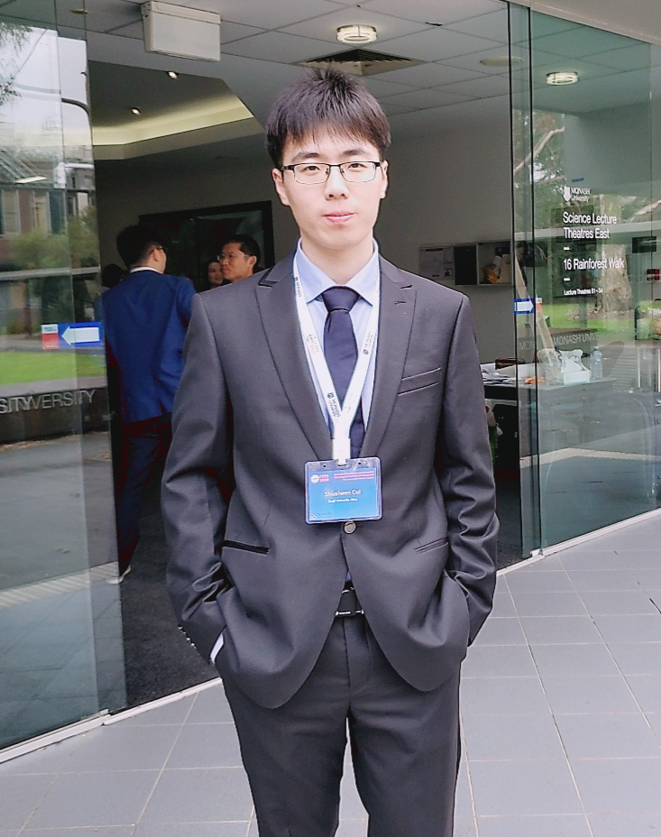

<!-- ---
comments: false
--- -->
# __关于我__

## __崔帅文__

<!-- {: width="30%"} -->
{: width="80%"}

>“本生用化，道法术器，守正用奇”

<a href="http://www.cuishuaiwen.com/CV_Shuaiwen_CUI_CN-2026.pdf" target="_blank">📜 查看与下载我的简历-中文 (2026)</a>

<a href="http://www.cuishuaiwen.com/CV_Shuaiwen_CUI_EN-2026.pdf" target="_blank">📜 查看与下载我的简历-英文 (2026)</a>

<!-- <a href="http://www.cuishuaiwen.com/CV_Shuaiwen_CUI_2025.pdf" target="_blank">📜 查看与下载我的简历 (2025)</a> -->

## 🏷️ __关键词__

泛在计算与智能 | 人工智能物联网 | 结构健康监测 | 智能体

## 🚀 __专长__

嵌入式系统硬件与软件开发 ｜ 边缘计算与智能 ｜ 信号处理 ｜ 物联网 ｜ 数字孪生 ｜ 人工智能 ｜ 系统识别 ｜ 结构健康监测

## 🎓 __教育背景__

| 学位   | 专业       | 学校               | 时间                  |
|--------|------------|--------------------|--------------------|
| 博士   | 土木工程（人工智能物联网/结构健康监测） | 南洋理工大学        | 2022年8月 - 至今        |
| 硕士   | 土木工程（地下建筑方向） | 同济大学           | 2018年9月 - 2021年6月   |
| 学士   | 土木工程（主修）/ 数学（辅修）   | 同济大学           | 2014年9月 - 2018年6月   |

## 🧰 __经历__

| 职位            | 公司                               | 时间                  |
|-----------------|----------------------------------|------------------------|
| 科研/教学助理    | 南洋理工大学, 新加坡 | 2022年8月 - 至今       |
| 产品研发（建筑数字孪生） | 华建数创, 中国上海 | 2021年8月 - 2022年6月  |

## 👨‍🏫 __教学__

CV1711 工程制图（CAD）与建筑信息模型（BIM）2025/2026学年

## 🔬 __研究__

**面向高效边缘计算与智能的软硬件基础设施和算法研究与开发（以结构健康监测为应用）**

(1) AIoT 系统前端硬件与软件开发：

- 嵌入式系统架构设计

- 嵌入式硬件电路设计

- 嵌入式软件驱动开发

- 实时操作系统FreeRTOS应用开发

-   :material-router-wireless:{ .lg .middle } __智能物联网节点开发__

    ---

    [:octicons-arrow-right-24: <a href="http://www.cuishuaiwen.com:9100" target="_blank"> 通用物联网节点 </a>](#)

    [:octicons-arrow-right-24: <a href="http://www.cuishuaiwen.com:8100/" target="_blank"> 专用物联网节点（结构健康监测） </a>](#)

(2) AIoT 系统后端云服务开发

- 云端架构设计与部署

- 后端数据库设计与管理

- MQTT中介服务器开发

- Web服务与API开发

-   :material-cloud:{ .lg .middle } __智能物联网云端枢纽开发__

    ---

    [:octicons-arrow-right-24: <a href="http://www.cuishuaiwen.com:9200" target="_blank"> 通用云后端 </a>](#)

    [:octicons-arrow-right-24: <a href="http://www.cuishuaiwen.com:8200" target="_blank"> 专用云后端（结构健康监测） </a>](#)

(3) AIoT 边缘设备计算与智能赋能框架

- 平台兼容层开发

- 数学运算子库开发

- 信号处理子库开发 

- 机器学习子库开发

- 结构健康监测专用模块开发

-   :fontawesome-solid-brain:{ .lg .middle } __泛在（嵌入式）智能赋能框架__

    ---

    [:octicons-arrow-right-24: <a href="http://www.cuishuaiwen.com:9200" target="_blank"> 通用框架 </a>](#)

    [:octicons-arrow-right-24: <a href="http://www.cuishuaiwen.com:8200" target="_blank"> 专用框架（结构健康监测） </a>](#)

## 📜 __论文发表__

**物联网结构健康监测**

- **Cui, S.**, Fu, Y.*, Xia, Y., Zhang Q., & Li, S. (2026). A Class-Lab-Field Pedagogical Framework for Structural Health Monitoring using Ultra-Low-Cost Wireless IoT Prototypes. IEEE Transactions on Education. (Under Review)

- **Cui, S.**, Fu, Y.*, Fu, H., & Shen, W. (2026). Edge-to-Cloud Computing and Intelligence for IoT-based Structural Health Monitoring: A Comprehensive Review. Advanced Engineering Informatics, 71, 104300. [https://doi.org/10.1016/j.aei.2025.104300](https://doi.org/10.1016/j.aei.2025.104300){:target="_blank"}

- **Cui, S.**, Fu, Y.*, Fu, H., Yu, X., & Shen, W. (2025). Smart Adaptive Trigger Sensing Powered by Edge Intelligence and Digital Twin for Energy-Efficient Wireless Structural Health Monitoring.  Mechanical Systems and Signal Processing, Volume 241, 2025, 113537. [https://doi.org/10.1016/j.ymssp.2025.113537](https://doi.org/10.1016/j.ymssp.2025.113537){:target="_blank"}

- **Cui, S.**, Yu, X., & Fu, Y.* (2025). Smart adaptive triggering strategy for edge intelligence enabled energy-efficient sensing. In *Proceedings of the 13th International Conference on Structural Health Monitoring of Intelligent Infrastructure (SHMII-13)*, pp. 609–616. Graz, Austria: Verlag der TU Graz. [https://doi.org/10.3217/978-3-99161-057-1-094](https://doi.org/10.3217/978-3-99161-057-1-094){:target="_blank"} (🏆 **最佳会议论文** 1st/202)

- **Cui, S.**, Hoang, T., Mechitov, K., Fu, Y.*, & Spencer Jr, B. F. (2025). Adaptive edge intelligence for rapid structural condition assessment using a wireless smart sensor network. Engineering Structures, 326, 119520. [https://doi.org/10.1016/j.engstruct.2024.119520](https://doi.org/10.1016/j.engstruct.2024.119520){:target="_blank"}

- Yu, X., Fu, Y., Yu, X., & **Cui, S.** (2026). Deep Learning-Enabled Data Synchronization for Non-Integer Time Lags in Wireless Structural Health Monitoring. IEEE Internet of Things Journal, 1–1. [https://doi.org/10.1109/JIOT.2026.3664904](https://doi.org/10.1109/JIOT.2026.3664904){:target="_blank"}

- Yu, X., Zhao, Y., **Cui, S.**, He, X., Fu, Y., & Yang, Q. (2025). Efficient edge intelligence for onboard data anomaly classification in wireless structural health monitoring using knowledge distillation on low-cost IoT nodes. Structural Health Monitoring. 2025;0(0). [https://doi.org/10.1177/14759217251349533](https://doi.org/10.1177/14759217251349533){:target="_blank"}

- Yu, X., **Cui, S.**, Fu, Y.*, & Zhang, Q. (2026). Decentralized system-centric sensor fault diagnosis and recovery using edge computing for wireless structural health monitoring systems. Measurement, Volume 261, 2026, 119994. [https://doi.org/10.1016/j.measurement.2025.119994](https://doi.org/10.1016/j.measurement.2025.119994){:target="_blank"}

- Fu, H., Deng, L., Tang, B., **Cui, S.**, & Fu, Y. (2025). Ultra-low memory spatiotemporal decomposition recurrent neural networks for edge structural fault monitoring. Applied Soft Computing, Volume 184, Part B, 2025, 113777. [https://doi.org/10.1016/j.asoc.2025.113777](https://doi.org/10.1016/j.asoc.2025.113777){:target="_blank"}

- Fu, H., Deng, L., Tang, B., **Cui, S.**, & Fu, Y. (2025). Neural networks micro memory control strategy for mechanical faults edge recognition. IEEE Transactions on Industrial Informatics, 21(7), 5069–5080, July 2025. [https://doi.org/10.1109/TII.2025.3545091](https://doi.org/10.1109/TII.2025.3545091){:target="_blank"}

**地下工程**

- Xu, J., **Cui, S.\***, Cai, W., Zhang, J., Zhu, M., & Cai, E. (2026). Stratigraphic Modelling and Probabilistic Parameter Estimation from Sparse Borehole Data via Bayesian Inference and LightGBM. Underground Space. (Under Review)

- **Cui, S.**, Tan, Y.*, & Lu, Y. (2020). Algorithm for generation of 3D polyhedrons for simulation of rock particles by DEM and its application to tunneling in boulder-soil matrix. Tunnelling and Underground Space Technology, 106, 103588. [https://doi.org/10.1016/j.tust.2020.103588](https://doi.org/10.1016/j.tust.2020.103588){:target="_blank"}

- Song, X., **Cui, S.**, Tan, Y., & Zhang, Y. (2022). Influence of water pressure on deep subsea tunnel buried within sandy seabed. Marine Georesources & Geotechnology, 40(8), 967–982. [https://doi.org/10.1080/1064119X.2021.1961954](https://doi.org/10.1080/1064119X.2021.1961954){:target="_blank"}

## ✍ __审稿人__

- Mechanical Systems and Signal Processing
- Nature Scientific Reports
- Urban Informatics

## 📄 __专利__

- Adaptive Triggering Mechanism for Time-Series Data Sensing on Edge Devices, 新加坡临时专利申请号 10202502426R, 2025. 
- An Adaptive Self-Diagnosis Mechanism For System-Centric Sensor Faults In Wireless IoT-Based Structural Health Monitoring Systems, 新加坡临时专利申请号 10202500862P, 2025.

## 🏆 __荣誉__

- **最佳会议论文奖**（1st/202），第13届智能基础设施结构健康监测国际会议，奥地利格拉茨，2025年9月。
- **第一名**，三分钟论文演讲展示竞赛，南洋理工大学土木与环境工程学院，新加坡，2025年3月。
- **同济大学优秀毕业生**，中国上海，2021年6月。

## 🔗 __链接__

-   :fontawesome-solid-house:{ .lg .middle } __技术博客__

    ---

    我的技术博客

    [:octicons-arrow-right-24: <a href="http://www.cuishuaiwen.com:8000" target="_blank"> 传送门 </a>](#)

-   :fontawesome-brands-linkedin:{ .lg .middle } __领英主页__

    ---

    领英资料页

    [:octicons-arrow-right-24: <a href="https://www.linkedin.com/in/shaun-shuaiwen-cui/" target="_blank"> 传送门 </a>](#)

-   :fontawesome-brands-github:{ .lg .middle } __Github__

    ---

    Github主页

    [:octicons-arrow-right-24: <a href="https://github.com/Shuaiwen-Cui" target="_blank"> 传送门 </a>](#)

-   :fontawesome-brands-google-scholar:{ .lg .middle } __Google学术__

    ---

    Github主页

    [:octicons-arrow-right-24: <a href="https://scholar.google.com/citations?user=hFJ2pbQAAAAJ&hl=en" target="_blank"> 传送门 </a>](#)

-   :fontawesome-brands-researchgate:{ .lg .middle } __Researchgate__

    ---

    Researchgate主页

    [:octicons-arrow-right-24: <a href="https://www.researchgate.net/profile/Shuaiwen-Cui" target="_blank"> 传送门 </a>](#)

-   :fontawesome-brands-youtube:{ .lg .middle } __Youtube__

    ---

    Youtube频道

    [:octicons-arrow-right-24: <a href="https://www.youtube.com/channel/UCGNpQ1avIeJVN2tQ2U0zHog" target="_blank"> 传送门 </a>](#)

-   :fontawesome-brands-bilibili:{ .lg .middle } __BiliBili__

    ---

    Bilibili频道

    [:octicons-arrow-right-24: <a href="https://space.bilibili.com/422612631" target="_blank"> 传送门 </a>](#)

